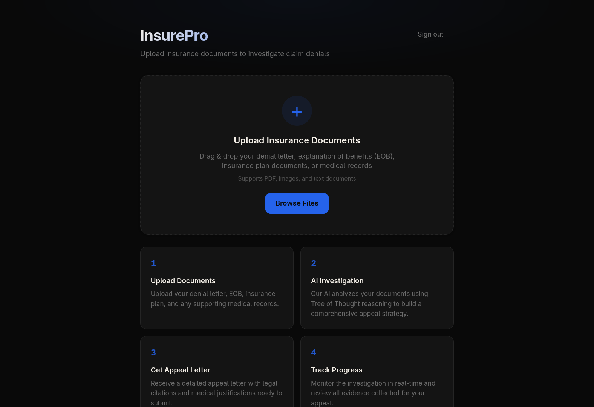
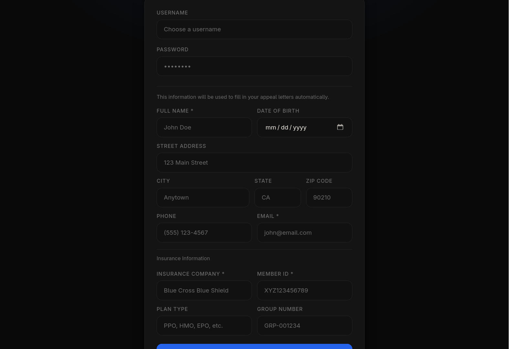
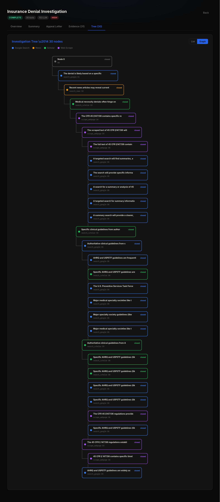
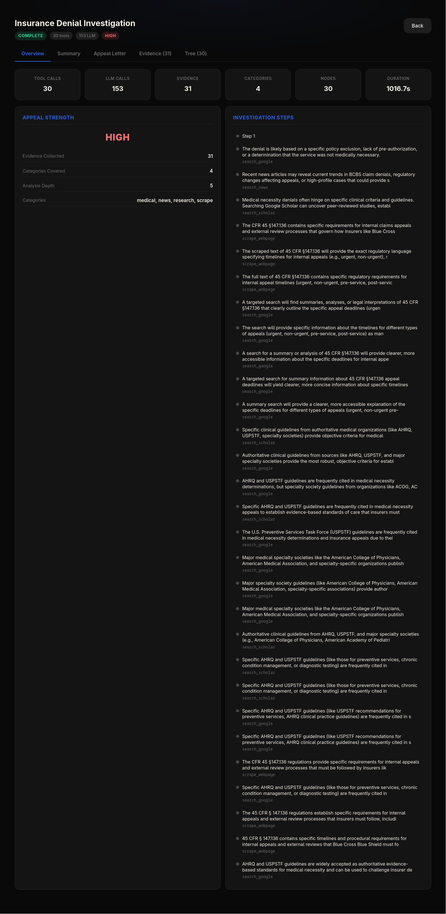
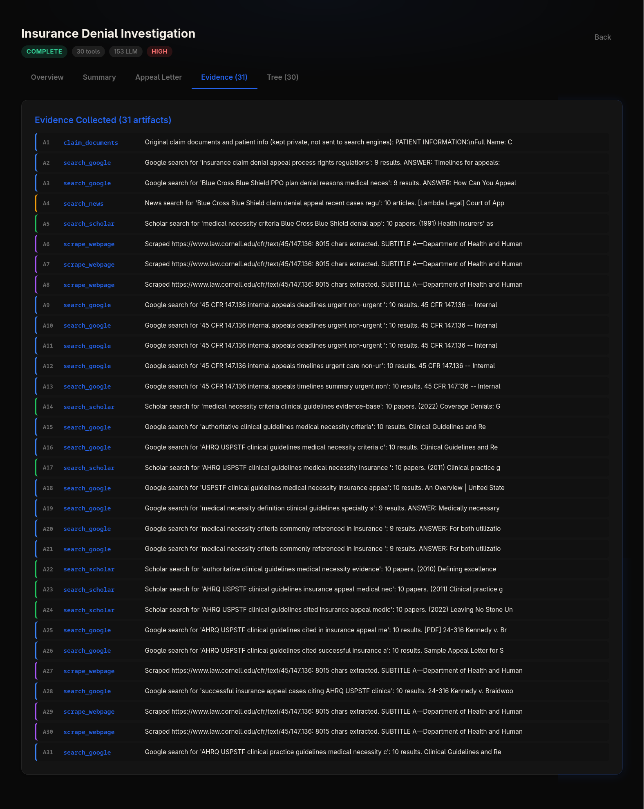
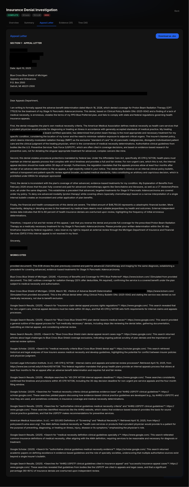
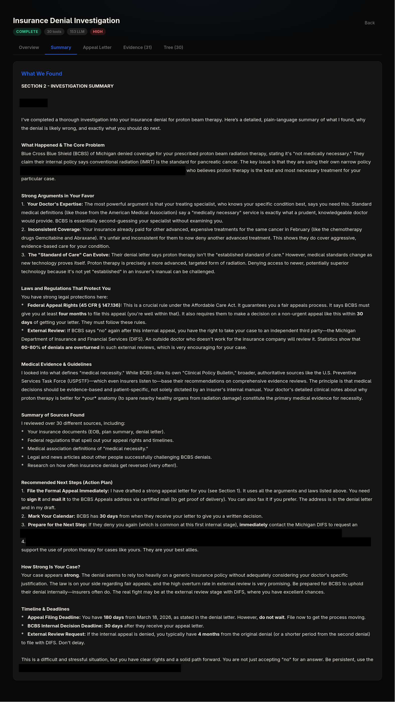

# InsurePro

**AI-Powered Insurance Denial Investigator**

Removing barriers between patients and the healthcare coverage they're entitled to. Upload your denial letter, and InsurePro builds a comprehensive, legally-cited appeal letter in minutes — not hours.



---

## The Problem: An Invisible Accessibility Crisis

Every year, **over 450 million health insurance claims are denied** in the United States. The appeal process is deliberately complex — filled with legal jargon, strict deadlines, and multi-step bureaucratic procedures. The result: **fewer than 1% of denials are ever appealed**, even though patients win roughly **50% of the time** when they do.

This system disproportionately harms the people who need healthcare the most:

- **Cognitive Barriers** — Dense ERISA regulations and multi-step processes overwhelm patients with cognitive disabilities, brain fog, or executive function challenges.
- **Chronic Illness Burden** — Over 60 million chronically ill Americans face 12+ claims per year. Filing appeals while managing pain, fatigue, and treatment schedules is often impossible.
- **Physical Access Gaps** — Gathering documents, writing letters, and navigating phone trees creates physical barriers for patients with mobility or dexterity limitations.
- **Neurodivergent Exclusion** — Strict deadlines, ambiguous forms, and multi-system navigation disproportionately disadvantage people with ADHD, autism, and learning disabilities.

The average appeal takes **over 10 hours** of research, writing, and document gathering. InsurePro reduces that to **under 5 minutes**.

> **Sources:**
> - KFF. (2023). *Claims Denials and Appeals in ACA Marketplace Plans*. https://www.kff.org/private-insurance/issue-brief/claims-denials-and-appeals-in-aca-marketplace-plans/
> - Pollitz, K. (2024). *Claims Denials and Appeals in ACA Marketplace Plans in 2023*. Kaiser Family Foundation.
> - U.S. Government Accountability Office. (2011). *Private Health Insurance: Data on Application and Coverage Denials*. GAO-11-268. https://www.gao.gov/products/gao-11-268
> - Yadav, K. et al. (2020). *Association of Prior Authorization with Health Care Outcomes and Cost*. JAMA Internal Medicine. https://jamanetwork.com/journals/jamainternalmedicine
> - CMS. (2024). *Medicare Advantage Appeal Outcomes Data*. Centers for Medicare & Medicaid Services. https://www.cms.gov

---

## What InsurePro Does

InsurePro is an AI-powered platform that investigates insurance claim denials and generates ready-to-submit appeal letters with legal citations, medical evidence, and regulatory references.

### How It Works

| Step | What Happens |
|------|-------------|
| **1. Upload** | Drag & drop your denial letter, EOB, and plan documents. PII is redacted before any external searches. |
| **2. AI Investigation** | Tree of Thought reasoning explores every angle — policy terms, regulations, medical guidelines, legal precedents. |
| **3. Appeal Letter** | A professionally formatted appeal letter is generated with APA citations and a Works Cited section. |
| **4. Download & Submit** | Download as `.doc`, review, and submit directly to your insurance company. |



---

## The Engine: Tree of Thought Reasoning

InsurePro uses a custom investigation engine based on the **Tree of Thought** framework (Yao et al., 2023). It employs **Depth-First Search (DFS) with backtracking** to systematically explore every avenue for your appeal.

> Yao, S., Yu, D., Zhao, J., Shafran, I., Griffiths, T. L., Cao, Y., & Narasimhan, K. (2023). *Tree of Thoughts: Deliberate Problem Solving with Large Language Models*. https://arxiv.org/abs/2305.10601

### How the Algorithm Works

1. **Initialize** — Denial documents become the root node with a goal, artifacts, and available tools
2. **Hypothesize** — The LLM generates a hypothesis and question for each investigation path
3. **Branch (DFS)** — Selects the best tool, executes it, creates a child node with new evidence
4. **Evaluate** — At each node, the LLM decides: keep exploring (open) or close and backtrack
5. **Backtrack** — Closed node conclusions propagate to the parent; the parent explores new paths
6. **Synthesize** — When the root closes, the entire tree is summarized into an appeal letter



### Real Tools, Real Research

Every investigation uses live web research — no hallucinated data:

| Tool | What It Does |
|------|-------------|
| `search_google` | Searches Google via Serper.dev for regulations, guidelines, and legal precedents |
| `search_news` | Searches Google News for recent regulatory changes and similar cases |
| `search_scholar` | Searches Google Scholar for peer-reviewed medical literature and clinical guidelines |
| `scrape_webpage` | Fetches and extracts full text from any URL (including PDFs) |

---

## Investigation Results

A typical investigation produces:

- **30+ tool calls** across Google Search, News, Scholar, and web scraping
- **150+ LLM reasoning steps** through the Tree of Thought
- **30+ evidence artifacts** with full provenance
- **A comprehensive appeal letter** with APA citations and Works Cited
- **A plain-language summary** explaining findings in simple terms





---

## Generated Appeal Letter

The appeal letter is professionally formatted, legally cited, and ready to mail:

- **Patient-specific arguments** tailored to your exact denial reason and plan
- **Legal citations** referencing 45 CFR Section 147.136, ACA protections, ERISA, and state regulations
- **Clinical guidelines** from AHRQ, USPSTF, and specialty medical societies
- **Works Cited section** with full APA bibliography of all sources
- **Download as .doc** with your name, insurer address, and deadlines pre-filled





---

## Tech Stack

| Layer | Technology |
|-------|-----------|
| **Frontend** | React 18, React Router, Tailwind CSS 4 |
| **Backend** | Jac (fullstack language), Python |
| **AI/LLM** | DeepSeek via byllm, Tree of Thought DFS engine |
| **Search** | Serper.dev (Google Search, News, Scholar APIs) |
| **PDF Extraction** | pypdf |
| **Auth** | Built-in Jac auth (JWT sessions) |

## Getting Started

```bash
# Install dependencies
jac install

# Set up environment variables
cp .env.example .env
# Add your DEEPSEEK_API_KEY and SERPER_API_KEY

# Start the dev server
jac start main.jac --dev
```

Then open http://localhost:8000/ in your browser.

## Project Structure

```
insure-pro/
├── main.jac                     # Entry point
├── index.cl.jac                 # Client router
├── jac.toml                     # Project config
├── services/
│   ├── insurance_tools.jac      # 4 real search/scrape tools with PII scrubbing
│   ├── investigation_v2.jac     # Tree of Thought DFS investigation engine
│   ├── insuranceService.jac     # PDF text extraction service
│   └── appService.jac           # Utility functions
├── pages/
│   ├── LoginPage.cl.jac         # Auth with patient info collection
│   ├── DashboardPage.cl.jac     # Document upload interface
│   └── InvestigationPage.cl.jac # Investigation UI, summary, appeal letter
├── components/
│   ├── InvestigationTree.cl.jac # DFS tree visualization
│   └── InvestigationLog.cl.jac  # Investigation trace log
└── styles/
    └── global.css               # Dark theme with blue accent
```

---

*Accessibility is a right. Appeals shouldn't require a law degree.*
